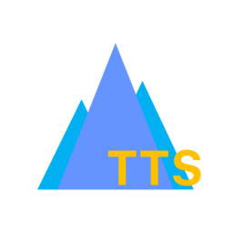
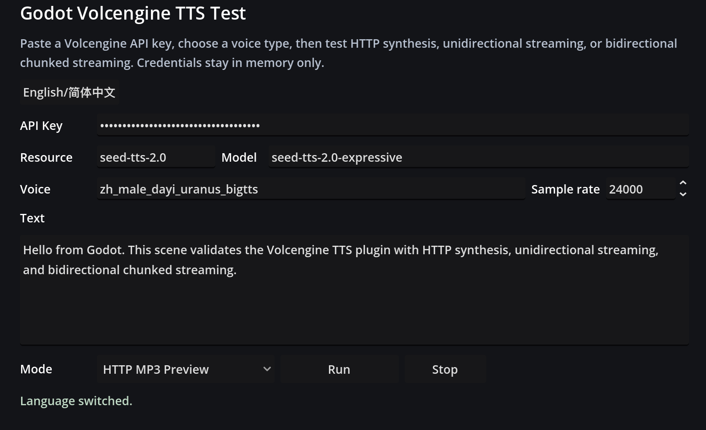
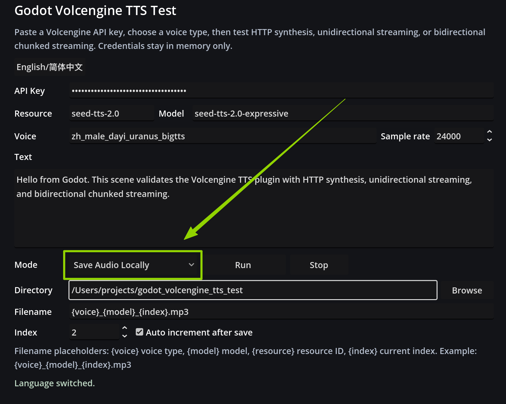

<div align="right">
  [<a href="./README.md">English</a>] [<a href="./README.zh-CN.md">简体中文</a>]
</div>

<div align="center">
  
  <h1>Godot Volcengine TTS</h1>
  <p>在 Godot 4.4+ 中直接流式播放、生成和预保存火山引擎豆包 TTS 音频</p>
</div>

Godot Volcengine TTS 是一个面向 Godot 4.4+ 的第三方火山引擎语音合成大模型 SDK，封装了火山引擎语音合成大模型的公开 API。

本项目用于在游戏和交互项目中接入火山引擎豆包语音合成。它提供高度封装的播放节点，也保留双向 WebSocket、单向流式和 HTTP 合成三个底层 Client，因此既可以用于实时角色对白、LLM 生成语音，也可以用于 UI 提示音、过场动画和固定台词缓存。

本项目的测试场景也提供将合成语音保存到本地的模式。开发者只需将项目 clone 到本地并使用 Godot 引擎打开，即可直接测试接口，并为游戏预生成语音，从而减少运行期重复合成带来的成本开销。

该项目最初是一个战棋游戏的副产品，被用于在该游戏中实时合成由 LLM 实时生成的文本。

## 建议

> 由于实时合成文本的成本较高，建议实际游戏项目中只对少量动态生成的文本采用实时合成，例如由 LLM 动态生成的角色台词；对于剧情对白、UI 文案、旁白等静态文本，建议在游戏开发阶段预合成并缓存。

插件详细文档：

- [英文插件文档](addons/godot_volcengine_tts/README.md)
- [中文插件文档](addons/godot_volcengine_tts/README.zh-CN.md)

详细文档有意放在 `addons/godot_volcengine_tts/` 目录内。Asset Library 导出包只包含
`addons/` 目录，因此用户通过插件包安装后仍能拿到使用说明和协议细节。文档和脚本放在一起，
也方便 Coding Agent、IDE 助手或维护者在阅读插件源码时直接发现相关上下文。

## 功能

支持三种常见合成路径：

| 端点 | 插件类 | 用途 | SSML | 输出 |
|---|---|---|---|---|
| `wss://openspeech.bytedance.com/api/v3/tts/bidirection` | `VolcengineTTSBidirectionalClient` | LLM token streaming 和高层 `speak()` 播放 | 否 | 用于播放的 PCM 流 |
| `wss://openspeech.bytedance.com/api/v3/tts/unidirectional/stream` | `VolcengineTTSUnidirectionalClient` | 一次提交文本，流式返回音频块 | 是 | PCM/MP3/WAV/Opus 分块 |
| `https://openspeech.bytedance.com/api/v3/tts/unidirectional` | `VolcengineTTSHttpClient` | 预生成或缓存完整音频 | 是 | 完整音频字节 |

一个容易混淆的实现细节：高层 `VolcengineStreamingVoicePlayer.speak()`
当前走的是官方双向 WebSocket 端点。它启动一个 session，一次性喂入整段文本，
发送 `FinishSession`，再把服务端返回的 PCM 音频块流式播放。官方单向流式端点也已实现，
但暴露为低层 `voice.uni_client.synthesize_streaming(...)` API。

这样设计主要是为了方便维护：高层播放路径和真正的 LLM token streaming 路径可以共享同一套
双向 session 生命周期、session_id 过滤、取消语义、PCM 队列和背压播放逻辑。官方单向流式
Client 仍然保留，适合需要指定单向端点、SSML 流式返回或自定义字节处理的调用方直接使用。

## 安装

复制插件目录到你的项目：

```text
addons/godot_volcengine_tts/
```

然后在 **项目设置 > 插件** 启用 **Godot Volcengine TTS**。

Asset Library 下载包通过 `.gitattributes` 限制为只包含 `addons/`，因此测试场景、截图和仓库文档不会污染用户项目。

## 简短示例

### 单句流式播放

```gdscript
extends Node

func _ready() -> void:
	var voice := VolcengineStreamingVoicePlayer.new()
	add_child(voice)

	for client in [voice.bidi_client, voice.uni_client, voice.http_client]:
		client.api_key = "your-volcengine-api-key"
		client.resource_id = "seed-tts-2.0"
		client.default_model = "seed-tts-2.0-expressive"

	await voice.speak("你好，Godot。", "zh_male_dayi_uranus_bigtts")
```

`speak()` 内部使用双向 WebSocket：启动一个 session，喂入整段文本，结束 session，
并把返回的 PCM 音频流式送入 Godot 播放。

底层所有 client 都会携带火山引擎请求头，包括 `X-Api-Key`、
`X-Api-Resource-Id`、`X-Api-Connect-Id` 或 `X-Api-Request-Id`，以及
`X-Control-Require-Usage-Tokens-Return: *`。调用参数由
`TtsOptions.build_req_params()` 统一组装，它会把
`{"format": "pcm", "speech_rate": 10}` 这类 Godot 扁平字典转换成火山协议的
`req_params`。

### 双向流式

```gdscript
await voice.start_streaming("zh_male_dayi_uranus_bigtts")

for chunk in ["桥已经修好了。", "守住阵线。"]:
	voice.feed_text(chunk)
	await get_tree().create_timer(0.25).timeout

voice.finish_streaming()
await voice.speak_finished
```

### 预生成 MP3

```gdscript
var mp3 := await voice.fetch_audio("欢迎回来，主公。", "zh_male_dayi_uranus_bigtts", {
	"format": "mp3",
})

var file := FileAccess.open("user://welcome.mp3", FileAccess.WRITE)
file.store_buffer(mp3)
```

## 测试场景

仓库包含本地测试场景 `scenes/test/tts_test.tscn`。它是一个中英文双语验证界面，可以输入火山引擎 API Key、resource ID、model、voice type、sample rate 和测试文本，并验证 HTTP MP3、单向 WebSocket PCM、双向分段流式和停止行为。

测试场景刻意覆盖了高层和低层两种调用方式：HTTP 按钮调用 `voice.fetch_audio()`；
单向 WS 按钮直接调用 `voice.uni_client.synthesize_streaming()`，并把 PCM 手动送入
`AudioStreamGenerator`；双向 WS 按钮调用 `voice.start_streaming()`、
`voice.feed_text()` 和 `voice.finish_streaming()`。



测试场景还提供 **Save Audio Locally** 模式，可将 HTTP 合成得到的音频直接保存到指定目录。保存界面支持选择输出目录、配置文件名模板、设置当前索引，并可在每次保存后自动递增索引，适合在开发阶段批量预生成固定台词音频。



测试场景只用于仓库内发布前验证，不会进入 Asset Library 下载包。

## 音色

火山引擎会持续更新可用音色。选择 `voice_type` 前请查看官方音色列表：

- https://www.volcengine.com/docs/6561/1257544

## 合规与服务说明

本项目是基于火山引擎公开接口文档实现的第三方非官方 Godot 集成，不隶属于字节跳动、火山引擎或豆包，也未获得其官方背书或赞助。

使用者需要自行提供火山引擎 API 凭证，并自行遵守相关服务条款、计费规则、调用限制、隐私要求和内容合规要求。

本文档中提到的产品名、服务名和商标归各自权利人所有。

有用的官方参考：

- 火山引擎 TTS 接口文档：https://www.volcengine.com/docs/6561/1598757
- 火山引擎 TTS 接口文档：https://www.volcengine.com/docs/6561/1719100
- 火山引擎 TTS 接口文档：https://www.volcengine.com/docs/6561/1329505
- 火山引擎 SDK 合规 / 隐私相关文档：https://www.volcengine.com/docs/6561/116711
- 火山引擎服务条款：https://www.volcengine.com/docs/6256/64903

## 许可证

MIT。详见 `LICENSE`。
